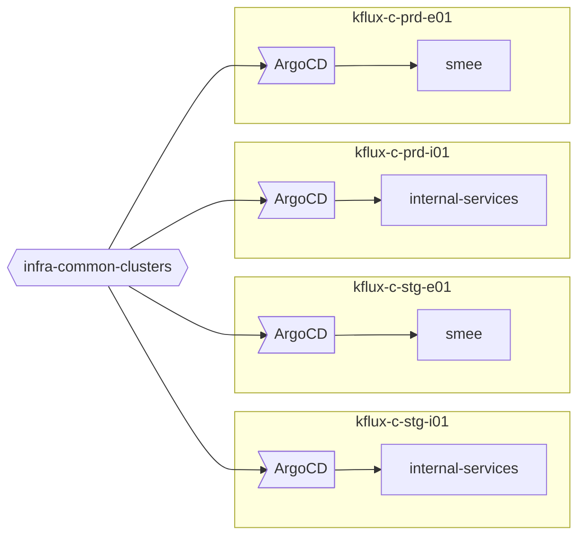

# Infra Common Clusters

A GitOps repository for managing shared infrastructure components across multiple Konflux common clusters using ArgoCD and Kustomize.

## Overview

This repository provides reusable infrastructure components and ArgoCD application definitions for deploying common services across different cluster types (internal/external) and environments (staging/production). It follows a GitOps approach where infrastructure changes are managed through Git and automatically deployed by ArgoCD.

## Repository Structure

```
infra-common-deployments/
├── argo-cd-apps/                           # ArgoCD Application definitions
│   ├── base/
│   │   ├── all-clusters/                   # Components deployed to ALL clusters
│   │   │   ├── external-secrets-operator/  # External Secrets Operator
│   │   │   └── iam/                        # Identity and Access Management
│   │   ├── external/                       # Components only for external clusters
│   │   │   └── smee/                       # Webhook forwarding service
│   │   └── internal/                       # Components only for internal clusters
│   │       └── internal-services/          # Internal service RBAC and configs
│   └── overlays/                           # Environment-specific configurations
│       ├── external-production/            # External production cluster config
│       ├── external-staging/               # External staging cluster config
│       ├── internal-production/            # Internal production cluster config
│       └── internal-staging/               # Internal staging cluster config
├── components/                             # Reusable Kustomize components
│   ├── external-secrets-operator/          # External Secrets Operator manifests
│   ├── iam/                                # IAM and group sync manifests
│   │   └── k-components/                   # Reusable IAM components
│   │       ├── external-ldap-url/          # External LDAP URL configuration
│   │       ├── internal-ldap-url/          # Internal LDAP URL configuration
│   │       ├── konflux-ldap-sa/            # Konflux LDAP service account
│   │       └── mtls-ca-validators/         # mTLS CA validators
│   ├── cluster-secret-store/               # Cluster secret store manifests
│   │   └── k-components/                   # Reusable secret store components
│   │       └── approle-id/                 # AppRole ID configuration
│   ├── smee/                               # Smee webhook service manifests
│   └── internal-services/                  # Internal services RBAC manifests
└── README.md
```


| Environment | Purpose | Cluster Short Name |
|-------------|---------|----------------|
| **internal-staging** | Internal Red Hat staging resources | `kflux-c-stg-i01` |
| **internal-production** | Internal Red Hat production resources | `kflux-c-prd-i01` |
| **external-staging** | External/public staging resources | `kflux-c-stg-e01` |
| **external-production** | External/public production resources | `kflux-c-prd-e01` |

## Architecture

### GitOps Flow



### App-of-Apps Pattern

This repository uses the **App-of-Apps pattern** where:

1. A root ArgoCD Application (`all-application-sets`) manages ApplicationSets
2. ApplicationSets automatically discover and deploy components
3. Components are deployed using Kustomize overlays per environment

## Deployment Guide

### Prerequisites

- OpenShift cluster with appropriate permissions
- ArgoCD installed and accessible
- Git repository access

### Bootstrap Process

#### 1. Deploy App-of-Apps

```bash
# Deploy the App-of-Apps for a cluster to let ArgoCD manage everything
kubectl apply -k argo-cd-apps/overlays/internal-production/
```

#### 2. Verify Deployment

```bash
# Check ArgoCD applications
kubectl get applications -n argocd

# Access ArgoCD UI
kubectl port-forward svc/argocd-server -n argocd 8080:80
# Open https://localhost:8080
```

### Environment-Specific Deployments

Each environment has its own overlay configuration:

```bash
# Staging Internal
kubectl apply -k argo-cd-apps/overlays/internal-staging/

# Staging External
kubectl apply -k argo-cd-apps/overlays/external-staging/

# Production Internal
kubectl apply -k argo-cd-apps/overlays/internal-production/

# Production External
kubectl apply -k argo-cd-apps/overlays/external-production/
```

## Current Components

### All-Clusters Components

#### External Secrets Operator

- **Purpose**: Manages external secrets from various secret stores
- **Location**: `components/external-secrets-operator/`
- **Deployment**: Applied to all clusters via `all-clusters` base
- **Resources**: Subscription, operator configuration, and namespace setup

#### IAM (Identity and Access Management)

- **Purpose**: Group synchronization and RBAC management
- **Location**: `components/IAM/`
- **Deployment**: Applied to all clusters via `all-clusters` base
- **Resources**: Group sync operator, Konflux Rover groups, role bindings, and test platform CI admin groups

### Environment-Specific Components

#### Smee (External Clusters Only)

- **Purpose**: Webhook forwarding service for external webhooks
- **Location**: `components/smee/`
- **Deployment**: Applied only to external clusters (staging/production)
- **Resources**: Deployment, service, and route for webhook forwarding

#### Internal Services (Internal Clusters Only)

- **Purpose**: RBAC, service accounts, and internal service configurations
- **Location**: `components/internal-services/`
- **Deployment**: Applied only to internal clusters (staging/production)
- **Resources**: Cluster roles, role bindings, service accounts, secrets, and CRD references

### Component Deployment Matrix

| Component | All Clusters | External Only | Internal Only |
|-----------|--------------|---------------|---------------|
| **External Secrets Operator** | ✅ | - | - |
| **IAM (Group Sync)** | ✅ | - | - |
| **Smee** | - | ✅ | - |
| **Internal Services** | - | - | ✅ |

### Environment Overlay Structure

Each overlay includes:

- **Base all-clusters**: IAM + External Secrets Operator
- **Environment-specific base**: Additional components for that cluster type
- **Environment patches**: Configuration overrides for staging/production

## Reusable Components (k-components)

This repository uses Kustomize Components to eliminate duplication between environments. These components are located in `k-components/` directories within each component folder.

### IAM k-components

Located in `components/iam/k-components/`:

- **external-ldap-url**: Configures LDAP URL for external clusters
- **internal-ldap-url**: Configures LDAP URL for internal clusters
- **konflux-ldap-sa**: Manages Konflux LDAP service account configuration
- **mtls-ca-validators**: Manages mTLS CA validators configuration

### Cluster Secret Store k-components

Located in `components/cluster-secret-store/k-components/`:

- **approle-id**: Configures AppRole ID for Vault authentication

### Benefits of k-components

- **DRY Principle**: Eliminates code duplication between environments
- **Maintainability**: Changes only need to be made in one place
- **Consistency**: Ensures identical behavior across environments
- **Reusability**: Components can be easily used in new environments


## Component Development

### Adding a New Component

1. **Create base component directory**:

   ```bash
   mkdir -p components/my-component/base
   cd components/my-component/base
   ```

2. **Create Kustomize base**:

   ```yaml
   # kustomization.yaml
   apiVersion: kustomize.config.k8s.io/v1beta1
   kind: Kustomization

   resources:
   - deployment.yaml
   - service.yaml

   namespace: my-component
   ```

   *Note: Be sure to name Kubernetes resource files after their Kubernetes kind*

3. **Add environment overlay(s)**:

   ```bash
   mkdir components/my-component/internal-staging
   mkdir components/my-component/internal-production
   ```

4. **Create overlay kustomization(s)**:

   ```yaml
   # components/my-component/internal-staging/kustomization.yaml
   apiVersion: kustomize.config.k8s.io/v1beta1
   kind: Kustomization

   namespace: my-component-staging

   resources:
   - ../base

   patchesStrategicMerge:
   - staging-patches.yaml
   ```

5. **Create a base ApplicationSet overlay**:

   *Note: If your component is only on either internal or external clusters, put the ApplicationSet in the proper folder.*

   ```yaml
   # argo-cd-apps/base/internal/base/my-component/appset.yaml
   apiVersion: argoproj.io/v1alpha1
   kind: ApplicationSet
   metadata:
   name: my-component
   spec:
   generators:
      - clusters:
         values:
            sourceRoot: components/my-component
            environment: base
            clusterName: ""
   template:
      metadata:
         name: my-component-{{values.clusterName}}
      spec:
         project: default
         source:
         path: '{{values.sourceRoot}}/{{values.environment}}'
         repoURL: https://github.com/redhat-appstudio/infra-common-deployments.git
         targetRevision: main
      destination:
        namespace: my-component-namespace
        server: '{{server}}'
      syncPolicy:
        automated:
          prune: true
          selfHeal: true
        syncOptions:
          - CreateNamespace=true
        retry:
          limit: -1
          backoff:
            duration: 10s
            factor: 2
            maxDuration: 3m
   ```

   ```yaml
   # argo-cd-apps/base/internal/base/my-component/kustomization.yaml
   apiVersion: kustomize.config.k8s.io/v1beta1
   kind: Kustomization
   resources:
   - appset.yaml
   ```

6. **Add component to base overlay**:

   *Note: If your component is only on either internal or external clusters, add the component to the environment's base overlay*

   ```yaml
   # argo-cd-apps/base/internal/base/kustomization.yaml
   apiVersion: kustomize.config.k8s.io/v1beta1
   kind: Kustomization
   resources:
   - internal-services
   - my-component
   ```

7. **Update other environment overlays if need be**:

   ```yaml
   # argo-cd-apps/overlays/internal-staging/kustomization.yaml
   apiVersion: kustomize.config.k8s.io/v1beta1
   kind: Kustomization
   resources:
   - ../base
   patches:
   - path: environment-patch.yaml
      target:
         group: argoproj.io
         version: v1alpha1
         kind: Application
   - path: special-patch.yaml
      target:
         group: argoproj.io
         version: v1alpha1
         kind: Application
         name: my-component
   ```
### Creating Reusable Components (k-components)

When you have identical patches or configurations across multiple environments, consider creating a k-component:

1. **Create k-components directory**:
   ```bash
   mkdir -p components/my-component/k-components/my-config
   ```

2. **Create component kustomization**:
   ```yaml
   # components/my-component/k-components/my-config/kustomization.yaml
   apiVersion: kustomize.config.k8s.io/v1alpha1
   kind: Component
   patches:
     - path: my-config-patch.yaml
       target:
         name: my-resource
         kind: MyResource
   ```

3. **Create the patch file**:
   ```yaml
   # components/my-component/k-components/my-config/my-config-patch.yaml
   apiVersion: my-api/v1
   kind: MyResource
   metadata:
     name: my-resource
   spec:
     # Your configuration here
   ```

4. **Reference in environment kustomizations**:
   ```yaml
   # components/my-component/external-production/kustomization.yaml
   apiVersion: kustomize.config.k8s.io/v1beta1
   kind: Kustomization
   resources:
     - ../base
   components:
     - ../k-components/my-config
   ```

5. **Remove duplicate patch files** from individual environment directories

## Testing and Validation

### Prerequisites

- `kustomize` CLI tool installed
- Access to the repository
- Understanding of the target environment

### Local Testing with Kustomize

#### 1. Test Individual Overlays

```bash
# Test external production overlay
kustomize build argo-cd-apps/overlays/external-production/

# Test external staging overlay
kustomize build argo-cd-apps/overlays/external-staging/

# Test internal production overlay
kustomize build argo-cd-apps/overlays/internal-production/

# Test internal staging overlay
kustomize build argo-cd-apps/overlays/internal-staging/
```

#### 2. Validate Component Structure

```bash
# Check what components are included in each overlay
kustomize build argo-cd-apps/overlays/external-production/ | grep "kind:" | sort | uniq

# Expected output should include:
# - ApplicationSet (for IAM, External Secrets Operator, Smee)
# - Any other resources from the components
```

#### 3. Verify Environment Patches

```bash
# Check that environment patches are applied correctly
kustomize build argo-cd-apps/overlays/external-production/ | grep -A 5 -B 5 "environment:"

# Should show "external-production" for external-production overlay
```

### Testing Specific Components

#### Test External Secrets Operator

```bash
# Build just the component
kustomize build components/external-secrets-operator/base/

# Build with environment overlay
kustomize build components/external-secrets-operator/external-production/
```

#### Test IAM Component

```bash
# Build just the component
kustomize build components/IAM/base/

# Build with environment overlay
kustomize build components/IAM/external-production/
```

#### Test k-components

```bash
# Test individual k-component
kustomize build components/iam/k-components/konflux-ldap-sa/

# Test component with k-components
kustomize build components/iam/external-production/
```

### Validation Checklist

When testing, verify that:

- [ ] **All overlays build successfully** without errors
- [ ] **Environment patches are applied** correctly
- [ ] **Component resources are included** as expected
- [ ] **No duplicate resources** are generated
- [ ] **Namespace assignments** are correct
- [ ] **Resource references** are valid

## Troubleshooting

### Common Issues

#### 1. Kustomize Build Errors

- **Problem**: `replace operation does not apply: doc is missing path`
- **Solution**: Check that ApplicationSet structures match the expected paths for environment patches

#### 2. Missing Components

- **Problem**: Expected components not appearing in build output
- **Solution**: Verify kustomization.yaml files include all required resources

#### 3. Environment Patch Failures

- **Problem**: Environment not being set correctly
- **Solution**: Ensure ApplicationSet generators have the correct structure for patches

#### 4. k-component Issues

- **Problem**: Component not being applied
- **Solution**: Verify the component is referenced in the kustomization.yaml and the target specification matches the resource

- **Problem**: Duplicate patches after creating k-component
- **Solution**: Remove the original patch files from environment directories after creating the k-component

### Debug Commands

```bash
# Show kustomize build plan
kustomize build --dry-run argo-cd-apps/overlays/external-production/

# Validate YAML syntax
kustomize build argo-cd-apps/overlays/external-production/ | kubectl apply --dry-run=client -f -

# Check specific component
kustomize build components/external-secrets-operator/base/ --dry-run
```

## Development Workflow

### Modifying Existing Components

1. **Make changes** in component directory
2. **Test locally** with kustomize build
3. **Verify environment overlays** still work
4. **Test in staging** before production

## Best Practices

- **Always test locally** with `kustomize build` before committing
- **Use consistent naming** conventions across components
- **Keep environment-specific configs** in overlays, not bases
- **Document component dependencies** and requirements
- **Test all overlays** when making changes to base components

## Contributing

1. **Fork** the repository
2. **Create** a new branch (`git checkout -b feature/my-component`)
3. **Test** changes in staging environment
4. **Submit** a merge request with:
   - Component documentation
   - Environment-specific configurations
   - Test validation results

### Review Checklist

- [ ] Component follows established patterns
- [ ] Environment overlays are complete
- [ ] Documentation is updated
- [ ] Security considerations addressed
- [ ] Monitoring configured
- [ ] Tested in staging environment

## Support

For issues or questions:

1. Check the troubleshooting section above
2. Review the component-specific documentation
3. Test with kustomize build locally
4. Check ArgoCD logs for deployment issues

## References

- [ArgoCD Documentation](https://argo-cd.readthedocs.io/)
- [Kustomize Documentation](https://kustomize.io/)
- [OpenShift GitOps](https://docs.openshift.com/container-platform/latest/cicd/gitops/understanding-openshift-gitops.html)
- [Konflux Documentation](https://konflux-ci.dev/)
