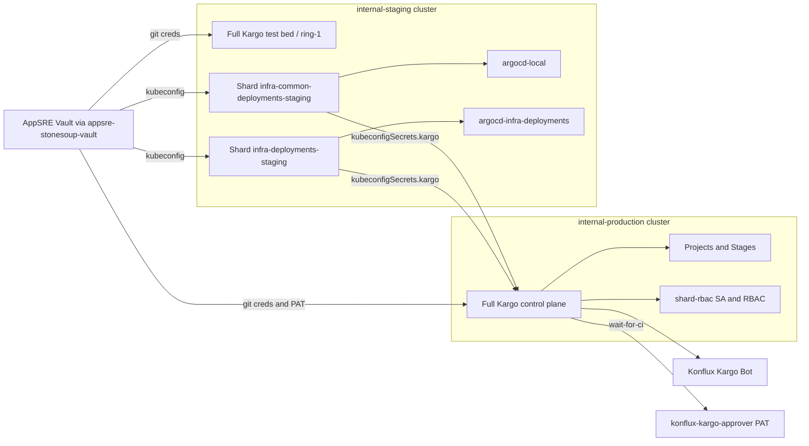

# Kargo

## Overview

[Kargo](https://kargo.io) automates progressive delivery of GitOps
configuration. In this repository it watches container images and Helm charts,
bundles new versions into **freight**, and runs **promotions** that open pull
requests to move those versions through staging and production.

| Concept | Meaning in practice |
|---|---|
| **Warehouse** | Polls registries/repos and creates freight when new versions appear |
| **Freight** | A versioned bundle of artifacts (images/charts) ready to promote |
| **Stage** | An environment step in a pipeline (for example ring-1 staging) |
| **PromotionTask** | Reusable steps that update files, open PRs, wait for CI, merge |
| **Shard** | A controller instance that talks to one Argo CD namespace (1:1) |

## Topology

There are three related pieces:

1. **Production control plane**: the main Kargo instance everything else
   connects to.
2. **Staging control plane**: a full Kargo install used as a test bed and as
   **ring-1** when promoting new Kargo releases.
3. **Shards on staging**: controller-only installs that bridge the production
   control plane to Argo CD instances on the staging cluster.



| Piece | Cluster / overlay | Role |
|---|---|---|
| Production control plane | `internal-production` | Primary API, projects, stages, shard RBAC |
| Staging control plane | `internal-staging` | Test bed; ring-1 target for Kargo upgrades |
| Shard `infra-common-deployments-staging` | staging (`kargo-shard`) | Controllers for production stages → `argocd-local` |
| Shard `infra-deployments-staging` | staging (`kargo-shard`) | Controllers for production stages → `argocd-infra-deployments` |

Kargo requires a **1:1 relationship** between a Kargo controller (shard) and an
Argo CD instance/namespace. Shards exist so the production control plane can
drive Argo CD that runs on staging without colocating those controllers on the
production cluster.

## Repository layout

| Path | Purpose |
|---|---|
| [`.`](.) (`components/kargo/`) | Full control-plane overlays (`base/`, `internal-staging/`, `internal-production/`) |
| [`../kargo-shard/`](../kargo-shard/) | Controller-only shard overlays (staging) |
| [`../cluster-secret-store/base/appsre-stonesoup-vault-secret-store.yaml`](../cluster-secret-store/base/appsre-stonesoup-vault-secret-store.yaml) | ClusterSecretStore for AppSRE Vault |
| [`../../argo-cd-apps/base/internal/kargo/`](../../argo-cd-apps/base/internal/kargo/) | ApplicationSet that deploys `components/kargo` |
| [`../../argo-cd-apps/overlays/internal-staging/kargo-shard-infra-common-deployments.yaml`](../../argo-cd-apps/overlays/internal-staging/kargo-shard-infra-common-deployments.yaml) | ApplicationSet for the common-deployments shard |
| [`../../argo-cd-apps/overlays/internal-staging/kargo-shard-infra-deployments.yaml`](../../argo-cd-apps/overlays/internal-staging/kargo-shard-infra-deployments.yaml) | ApplicationSet for the infra-deployments shard |

Control-plane layout:

```text
components/kargo/
├── base/                         # Route/OAuth + shared RBAC
├── internal-staging/
│   ├── deployment/               # HelmChartInflationGenerator (full install)
│   └── projects/                 # Staging/test projects
└── internal-production/
    ├── deployment/               # HelmChartInflationGenerator (full install)
    ├── shard-rbac/               # SA/RBAC/secrets for remote shards
    └── projects/
        ├── kargo-infra-common/   # Promotes this repo (infra-common-deployments)
        └── kargo-infra-deployments/  # Multi-ring pipeline for infra-deployments
```

Shard layout:

```text
components/kargo-shard/internal-staging/
├── infra-common-deployments/     # shardName: infra-common-deployments-staging
└── infra-deployments/            # shardName: infra-deployments-staging
```

## Control planes

Both overlays deploy a **full** Kargo release via Kustomize
`HelmChartInflationGenerator`:

- Staging: [internal-staging/deployment/kargo-helm-generator.yaml](internal-staging/deployment/kargo-helm-generator.yaml)
- Production: [internal-production/deployment/kargo-helm-generator.yaml](internal-production/deployment/kargo-helm-generator.yaml)

Shared traits:

- Chart from `oci://ghcr.io/akuity/kargo-charts`, images from `quay.io/konflux-ci/kargo` (and Dex from `quay.io/konflux-ci/dex`)
- Namespace: `kargo`
- API exposed via OpenShift Route; Dex uses OpenShift as an OIDC connector
- Admin account disabled; access via OIDC group claims (for example
  `konflux-admins`, `konflux-devprod`, … — see the generator values)

### Production (`internal-production`)

- Main control plane for real promotion projects
- Includes [internal-production/shard-rbac/](internal-production/shard-rbac/) so
  staging shards can authenticate to this cluster
- Hosts `kargo-infra-common` and `kargo-infra-deployments`

### Staging (`internal-staging`)

- Full install used as a **test bed** for new Kargo chart/image versions
- Acts as **ring-1** in the Kargo self-promotion pipeline: new versions land in
  the staging generator first, soak, then promote to production
- Hosts lighter/test projects (for example `konflux-devprod-poc`)

Exact chart/image tags change over time; always read the generator files rather
than pinning versions in docs.

## Shards

Manifests live under [`../kargo-shard/`](../kargo-shard/). Each shard is a
controller-only Helm install:

- API, webhooks, garbage collector, management controller, CRDs, and cluster
  RBAC install are **disabled** (the production control plane owns the data
  plane)
- `controller.shardName` identifies the shard
- `controller.argocd` points at exactly one Argo CD namespace
- `kubeconfigSecrets.kargo` names the secret that holds kubeconfig for the
  **host** (production) control plane

| Shard name | Namespace | Argo CD namespace | Generator |
|---|---|---|---|
| `infra-common-deployments-staging` | `kargo-shard-infra-common-deployments` | `argocd-local` | [kargo-shard-helm-generator.yaml](../kargo-shard/internal-staging/infra-common-deployments/deployment/kargo-shard-helm-generator.yaml) |
| `infra-deployments-staging` | `kargo-shard-infra-deployments` | `argocd-infra-deployments` | [kargo-shard-helm-generator.yaml](../kargo-shard/internal-staging/infra-deployments/deployment/kargo-shard-helm-generator.yaml) |

Stages on the production control plane select a shard with `spec.shard` (for
example `ring-1-staging` uses `infra-common-deployments-staging`). The matching
controller on staging executes those promotions against its Argo CD namespace.

### Host connection (kubeconfig)

Shards pull a kubeconfig from AppSRE Vault via ExternalSecret
`production-kargo-kubeconfig` (Vault path `staging/devprod/kargo-shard-kubeconfig`).
Helm maps that secret through `kubeconfigSecrets.kargo` so the shard controller
can reach the production Kargo API/cluster.

### Production shard RBAC

On the production cluster, [internal-production/shard-rbac/](internal-production/shard-rbac/)
provides:

- ServiceAccount `kargo-shard-staging` (and token secret)
- RoleBindings into project/shared namespaces such as `kargo-shared-resources`
  and `kargo-infra-common`
- Git credentials ExternalSecret in `kargo-shared-resources`

Without this RBAC, remote shard controllers cannot operate on host-cluster
resources needed for promotions.

## Secrets and Vault

> **Security note:** Credential *values* (tokens, kubeconfigs, AppRole
> material, GitHub App private keys) live only in AppSRE Vault and are synced
> into the cluster by External Secrets. This handbook documents path names and
> wiring only. Never commit secret payloads to git.

### ClusterSecretStore

[`appsre-stonesoup-vault`](../cluster-secret-store/base/appsre-stonesoup-vault-secret-store.yaml) points at AppSRE Vault. 
Kargo-related namespaces are allowlisted on that store so ExternalSecrets in those namespaces can sync.

### Vault paths used by Kargo

| Vault path | In-cluster secret (examples) | Purpose |
|---|---|---|
| `production/devprod/kargo-secrets-prod` | `kargo-infra-common-secrets`, `kargo-git-credentials` | Git credentials / bot material and `github_pat` for `kargo-infra-common` |
| `staging/devprod/kargo-secrets-stage` | `konflux-devprod-poc-secrets` | Staging/test project git credentials |
| `production/devprod/infra-deployments-bot` | `kargo-infra-deployments-secrets` | Git credentials and `github_pat` for `kargo-infra-deployments` |
| `staging/devprod/kargo-shard-kubeconfig` | `production-kargo-kubeconfig` (shard namespaces) | Kubeconfig for shard → production host |

Secrets used as Kargo git credentials are labeled
`kargo.akuity.io/cred-type: git` by the ExternalSecret templates.

## GitHub integration

Kargo uses **two distinct GitHub identities**. Do not conflate them.

### Konflux Kargo Bot (GitHub App)

- App: [Konflux Kargo Bot](https://github.com/apps/konflux-kargo-bot)
- Used for Git/PR automation (clone, push, open/merge PRs)
- Auth material is stored in AppSRE Vault and synced into secrets labeled
  `kargo.akuity.io/cred-type: git`

### `konflux-kargo-approver` (PAT for CI polling)

- GitHub account that owns a personal access token used for **API** calls
- Consumed by the shared PromotionTask
  [wait-for-ci.yaml](internal-production/projects/kargo-infra-common/base/promotiontasks/wait-for-ci.yaml)
- The task polls GitHub `check-runs` and commit `status` while a promotion waits
  for CI
- Token details are stored in AppSRE Vault and appear in-cluster as the
  `github_pat` field on secrets such as `kargo-infra-common-secrets` (from
  `production/devprod/kargo-secrets-prod`)

### infra-deployments bot path

The `kargo-infra-deployments` project uses Vault path
`production/devprod/infra-deployments-bot` → secret
`kargo-infra-deployments-secrets`, including its own `wait-for-ci` variant that
reads `github_pat` from that secret.

## Projects and promotion model

### `kargo-infra-common`

Promotes components in **this** repository (`infra-common-deployments`).

| Stage | Policy | Role |
|---|---|---|
| `ring-1-staging` | Auto-promotion enabled | Updates `internal-staging` configs, opens PR, waits for CI, merges |
| `ring-2-production` | Manual approval | Promotes freight that already succeeded in staging into `internal-production` |

Typical flow:

1. Warehouse discovers a new image/chart version → freight
2. Stage runs PromotionTasks (`yaml-update` per component, guarded by freight origin)
3. Commit + push + open PR
4. `wait-for-ci` polls GitHub until checks succeed
5. Merge PR; Argo CD syncs the updated GitOps paths

Onboarding a new component:
[internal-production/projects/kargo-infra-common/README.md](internal-production/projects/kargo-infra-common/README.md)
(and the agent skill [`../../skills/kargo-onboard.md`](../../skills/kargo-onboard.md)).

### `kargo-infra-deployments`

Separate project for the `infra-deployments` repository with a **multi-ring**
stage model (`ring-0` … `ring-4` under
[internal-production/projects/kargo-infra-deployments/](internal-production/projects/kargo-infra-deployments/)).
Same general warehouse → freight → stage → PR → `wait-for-ci` pattern, with
credentials from `kargo-infra-deployments-secrets`.

### Staging control-plane projects

`internal-staging/projects/` holds test/PoC projects (for example
`konflux-devprod-poc`) used with the staging control plane, not the production
promotion rings above.

## Day-2 operations

### Upgrading Kargo

Kargo itself is a promoted component under
[internal-production/projects/kargo-infra-common/kargo/](internal-production/projects/kargo-infra-common/kargo/):

1. Warehouse watches the upstream chart/images
2. Ring-1 updates [internal-staging/deployment/kargo-helm-generator.yaml](internal-staging/deployment/kargo-helm-generator.yaml)
3. After soak/approval, ring-2 updates
   [internal-production/deployment/kargo-helm-generator.yaml](internal-production/deployment/kargo-helm-generator.yaml)

Keep shard chart/image versions compatible with the host control plane when
rolling upgrades.

### Validate locally

```sh
kustomize build --enable-helm components/kargo/internal-staging/
kustomize build --enable-helm components/kargo/internal-production/
kustomize build --enable-helm components/kargo-shard/internal-staging/infra-common-deployments/
kustomize build --enable-helm components/kargo-shard/internal-staging/infra-deployments/
kustomize build components/kargo/internal-production/projects/kargo-infra-common/
```

Note: CI kube-linter excludes `components/kargo/` and `components/kargo-shard/`
(Helm-inflated output).

### Troubleshooting pointers

| Symptom | Likely area |
|---|---|
| Shard cannot reach host Kargo | ExternalSecret `production-kargo-kubeconfig`, Vault path `staging/devprod/kargo-shard-kubeconfig`, production `shard-rbac` |
| Stage promotions never affect expected Argo CD apps | Wrong `spec.shard` / `shardName`, or Argo CD namespace mismatch (1:1 rule) |
| Git clone / open-PR / merge failures | Vault git / Konflux Kargo Bot material; ExternalSecret sync for `kargo.akuity.io/cred-type: git` secrets |
| Promotion stuck in `wait-for-ci` | Expired or rotated `konflux-kargo-approver` PAT in Vault; ExternalSecret sync of `github_pat`; GitHub API rate/auth errors |
| Manifests not applying | Argo CD ApplicationSets under `argo-cd-apps` for `kargo` / `kargo-shard-*` |

## Related links

- [Kargo documentation](https://docs.kargo.io/)
- [Konflux Kargo Bot](https://github.com/apps/konflux-kargo-bot)
- [Component onboarding (kargo-infra-common)](internal-production/projects/kargo-infra-common/README.md)
- [AppSRE Stonesoup Vault ClusterSecretStore](../cluster-secret-store/base/appsre-stonesoup-vault-secret-store.yaml)
- [Kargo ApplicationSet](../../argo-cd-apps/base/internal/kargo/appset.yaml)
- [Kargo onboard skill](../../skills/kargo-onboard.md)
